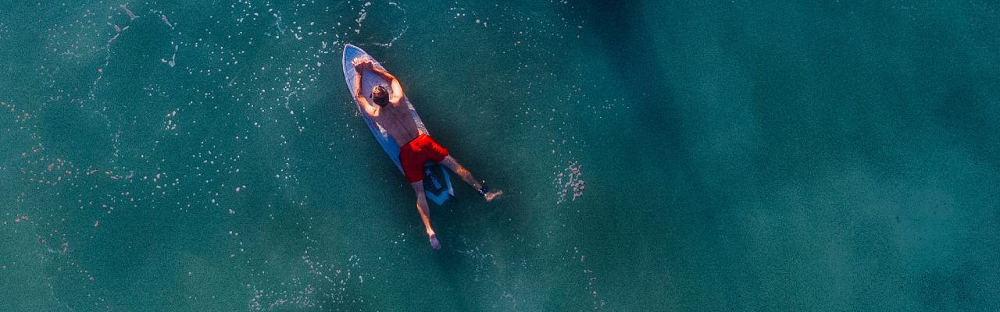
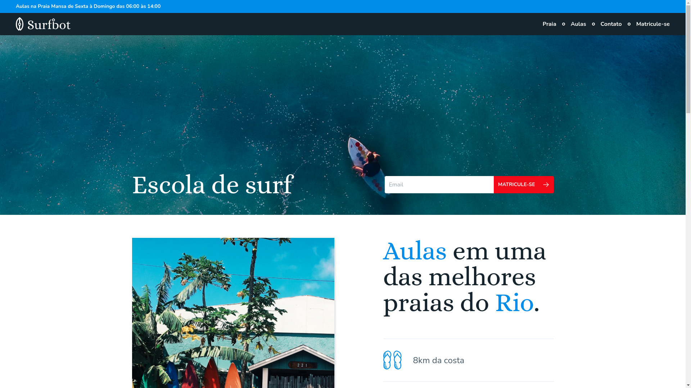

<h1 align="center">
    
</h1>

<p align="center">
  

  
  
  <a href="https://github.com/joao0pedro0alves/surfbot/commits/master">
    
  </a>
    
   

   <a href="https://github.com/joao0pedro0alves/surfbot/stargazers">
    
  </a>
</p>

<p>
  
</p>

<h4 align="center"> 
	Surfbot concluído 🚀
</h4>

<p align="center">
 <a href="#-about">About</a> |
 <!-- <a href="#-funcionalidades">Funcionalidades</a> | -->
 <a href="#-layout">Layout</a> | 
 <a href="#-how-it-works">How It Works</a> | 
 <a href="#-technologies">Technologies</a> | 
 <!-- <a href="#-contribuidores">Contribuidores</a> |  -->
 <a href="#-author">Author</a> | 
 <a href="#-deploy">Deploy</a> | 
 <a href="#-license">License</a>
</p>


## 💻 About

O Surfbot foi projetado e desenvolvido durante o curso *Advanced UI Design* na plataforma [Origamid](https://www.origamid.com/). É um clone do design original de [André Rafael](https://github.com/origamid).

Decidi recriar a interface usando React + TailwindCSS, para estudar essa forma de desenhar interfaces, e estou muito surpreso com a facilidade do TailwindCSS.

Futuramente pretendo estender um pouco o projeto, integrando ele ao GraphCMS com GraphQL, apenas para fins didáticos.

---

<!-- ## ⚙️ Funcionalidades

- [x] Empresas ou entidades podem se cadastrar na plataforma web enviando:
  - [x] uma imagem do ponto de coleta
  - [x] nome da entidade, email e whatsapp
  - [x] e o endereço para que ele possa aparecer no mapa
  - [x] além de selecionar um ou mais ítens de coleta: 
    - lâmpadas
    - pilhas e baterias
    - papéis e papelão
    - resíduos eletrônicos
    - resíduos orgânicos
    - óleo de cozinha

- [x] Os usuários tem acesso ao aplicativo móvel, onde podem:
  - [x] navegar pelo mapa para ver as instituições cadastradas
  - [x] entrar em contato com a entidade através do E-mail ou do WhatsApp

--- -->

## 🎨 Layout

Você pode visualizar o layout do projeto através [desse link](https://www.figma.com/community/file/982690157692261087). É necessário ter conta no [Figma](https://www.figma.com/) para acessá-lo.

### Web

<p align="center">
  
</p>

---

## 🚀 How it works

### Pré-requisitos

Antes de baixar o projeto você vai precisar ter instalado na sua máquina as seguintes ferramentas:

* [Git](https://git-scm.com)
* [NodeJS](https://nodejs.org/en/)
* [Yarn](https://yarnpkg.com/) ou [NPM](https://www.npmjs.com/)

Além disto é bom ter um editor para trabalhar com o código como [VSCode](https://code.visualstudio.com/)

#### 🧭 Rodando a aplicação web (Frontend)

```bash
# Clone este repositório
$ git clone https://github.com/joao0pedro0alves/surfbot.git

# Acesse a pasta do projeto no terminal/cmd
$ cd surfbot

# Instale as dependências
$ npm install

# Execute a aplicação em modo de desenvolvimento
$ npm run dev

# A aplicação será aberta na porta:3000 - acesse http://localhost:3000
```

---

## 🛠 Technologies

As seguintes ferramentas foram usadas na construção do projeto:

#### **Website**  ([Vite](https://vitejs.dev/)  +  [TypeScript](https://www.typescriptlang.org/))

-   **[TailwindCSS](https://tailwindcss.com/)**
-   **[PostCSS](https://postcss.org/)**
-   **[Clsx](https://www.npmjs.com/package/clsx)**
-   **[PhosporReact](https://phosphoricons.com/)**

> Veja o arquivo  [package.json](https://github.com/joao0pedro0alves/surfbot/blob/main/package.json)

---
## 💪 Como contribuir para o projeto

1. Faça um **fork** do projeto.
2. Crie uma nova branch com as suas alterações: `git checkout -b my-feature`
3. Salve as alterações e crie uma mensagem de commit contando o que você fez: `git commit -m "feature: My new feature"`
4. Envie as suas alterações: `git push origin my-feature`
> Caso tenha alguma dúvida confira este [guia de como contribuir no GitHub](./CONTRIBUTING.md)

---

## Deploy

<br />

* Clique no link a seguir para acessar o projeto !! [Surfbot](https://joao-alves-surbot.netlify.app/)

[](https://app.netlify.com/sites/joao-alves-surbot/deploys)

---
## 🦸 Author

<a href="https://github.com/joao0pedro0alves">
 
 <br />
 <br />
 <strong>João Alves</strong>
</a>

<br />
<br />

<a href="https://instagram.com/joaao_alvees" target="_blank"></a>
<a href = "mailto:contato@joao.alves1032003@gmail.com"></a>
<a href="https://www.linkedin.com/in/jo%C3%A3o-pedro-alves-pereira-bb0052216/" target="_blank"></a>

---

## 📝 License

Este projeto esta sobe a licença [MIT](./LICENSE).

Feito com 💜 por João Alves 👋🏽 [Entre em contato!](https://www.linkedin.com/in/jo%C3%A3o-pedro-alves-pereira-bb0052216/)

---
